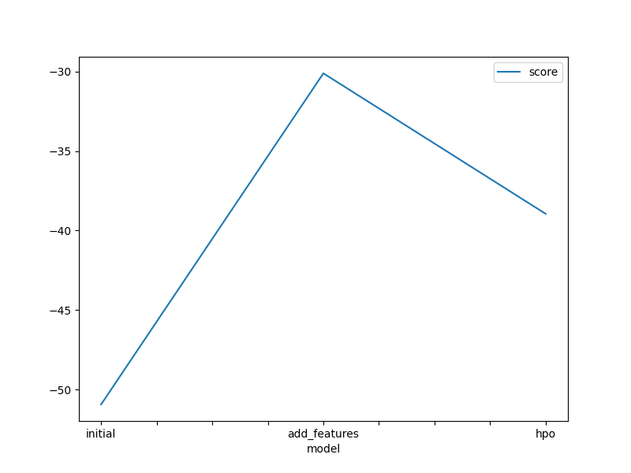
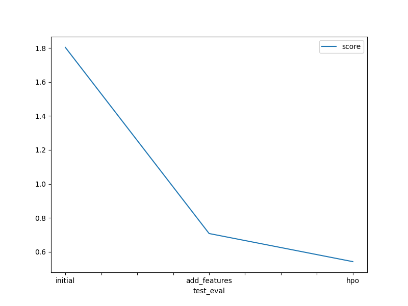

# Report: Predict Bike Sharing Demand with AutoGluon Solution
#### Ihssan Doukali ( Kaggle username : idoukk )

## Initial Training
### What did you realize when you tried to submit your predictions? What changes were needed to the output of the predictor to submit your results?
The only issue I encountered was an error message statint that username is not found, I had to set env variables with kaggle username and kaggle key to ne able to submit my predictions to Kaggle's Bike sharing demande competition.

### What was the top ranked model that performed?
WeightedEnsemble_L3 performed best in raw and new_features trainings

## Exploratory data analysis and feature creation
### What did the exploratory analysis find and how did you add additional features?
I added hours as a new feature.

### How much better did your model preform after adding additional features and why do you think that is?
My Kaggle score increased from 1.80337 to 0.70794. As can be seen through EDA, bike sharing depends on time Adding hour made the pattern clear to the model.

## Hyper parameter tuning
### How much better did your model preform after trying different hyper parameters?
My kaggle score increased from 0.70794 to 0.54246 after introductiong hpo

### If you were given more time with this dataset, where do you think you would spend more time?
I would look into weather parameters and explore what additional ones can be infered and might benefit the model.
### Create a table with the models you ran, the hyperparameters modified, and the kaggle score.
|model|hpo1|hpo2|hpo3|score|
|--|--|--|--|--|
|initial|"best_quality"|"best_quality"|"best_quality"|1.80337|
|add_features|"best_quality"|"best_quality"|"best_quality"|0.70794|
|hpo|XGBoost(XGB): n_estimators: space.Int(lower=100, upper=400, default=100), max_depth: ag.space.Int(lower=4, upper=12, default=6), learning_rate: space.Real(1e-4, 1e-2, default=5e-4, log=True)|CatBoost(CAT): 'iterations' : 100, 'learning_rate': space.Real(1e-4, 1e-2, default=5e-4, log=True), 'depth' : space.Int(lower=6, upper=10)|Gradient Boosting Machine(GBM): 'num_boost_round': 100, 'num_leaves': space.Int(lower=26, upper=66, default=36)|0.54246|

### Create a line plot showing the top model score for the three (or more) training runs during the project.

### Create a line plot showing the top kaggle score for the three (or more) prediction submissions during the project.

## Summary
TODO: Add your explanation
